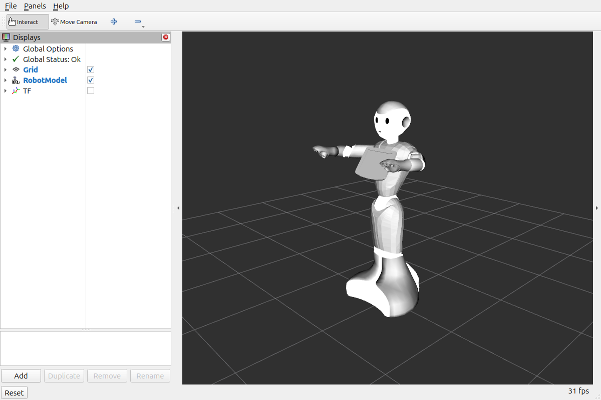
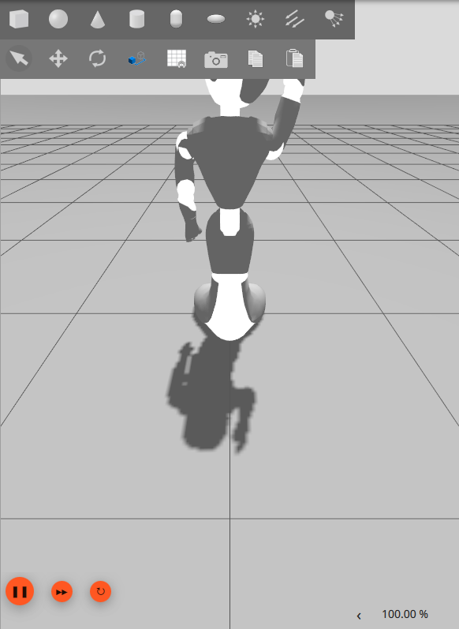
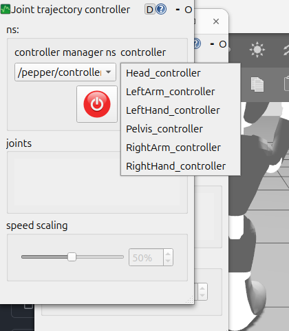
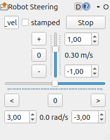
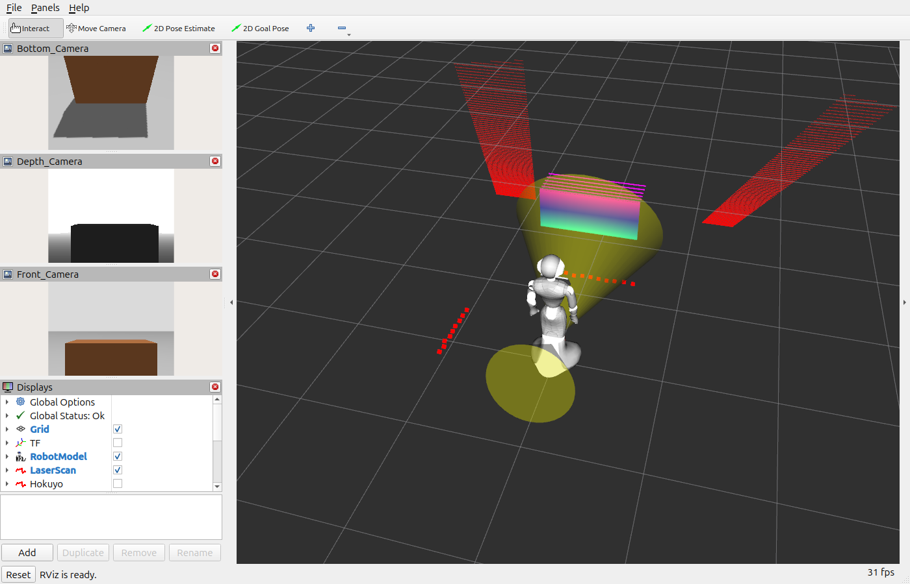
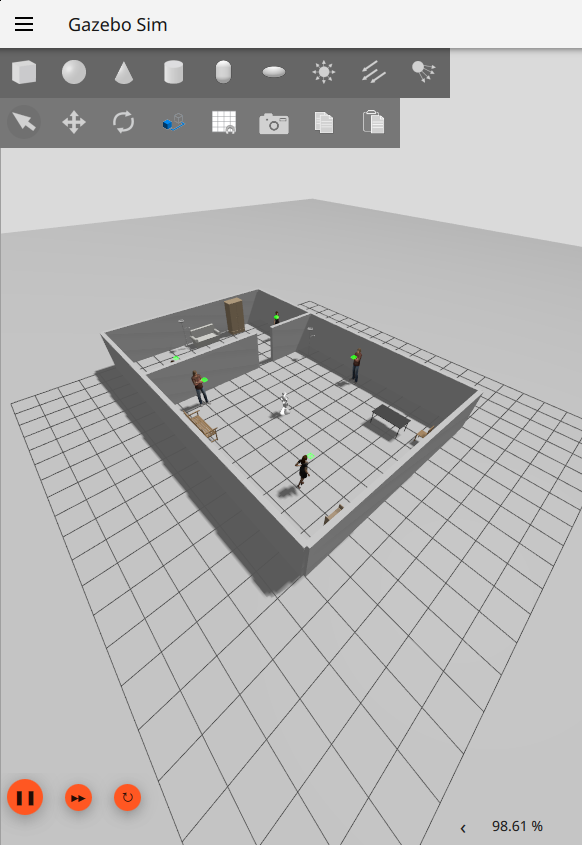
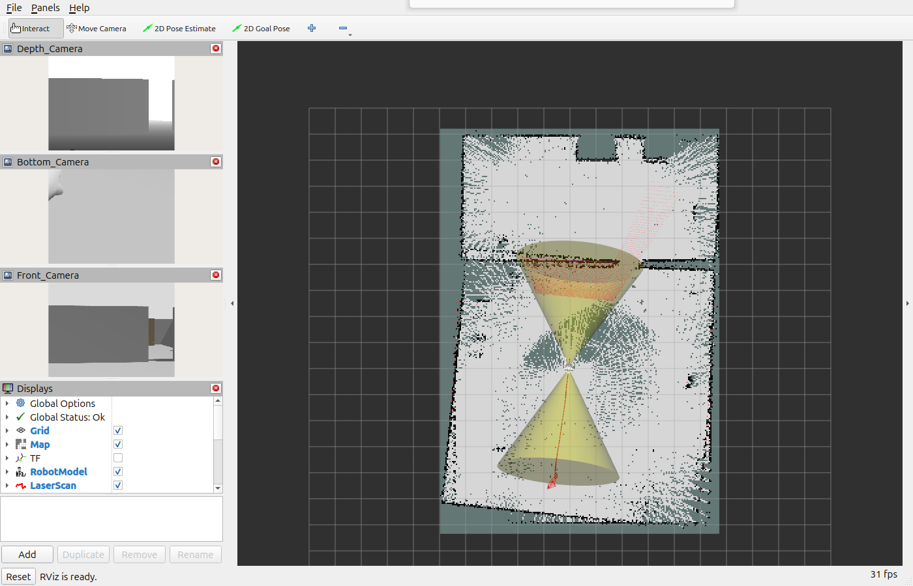
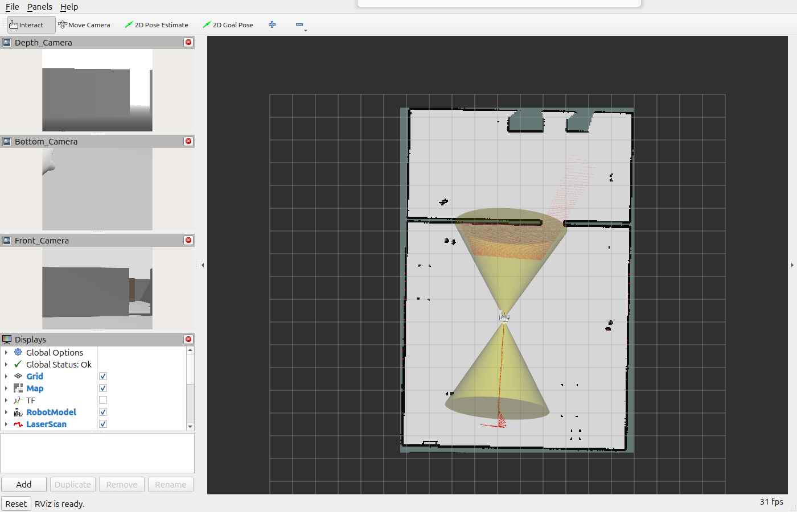
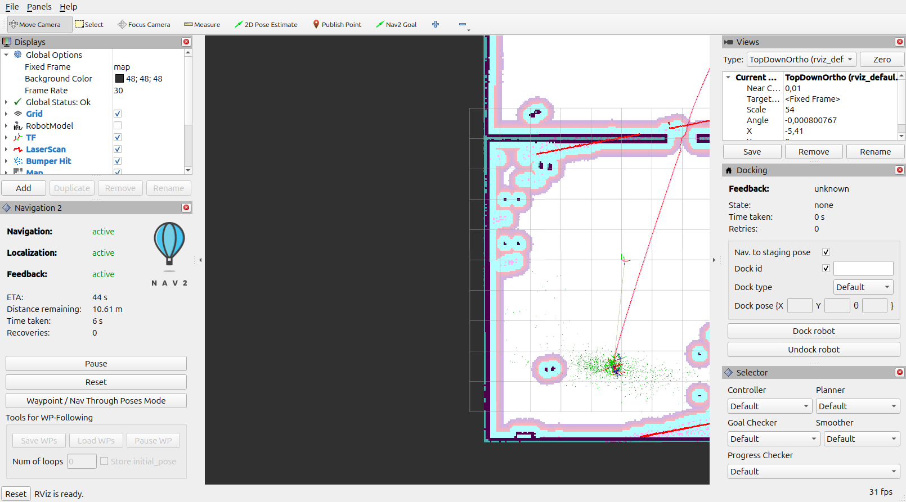
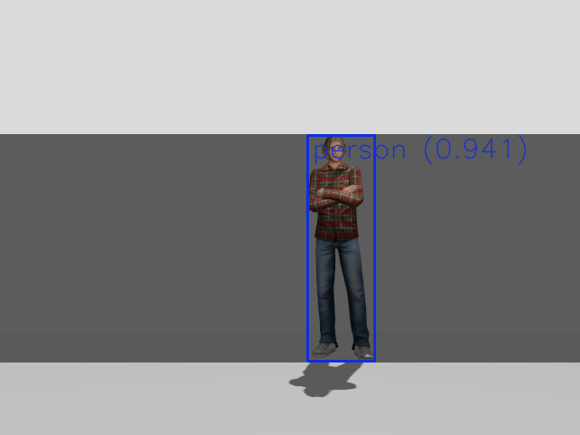

# Pepper en ROS 2 Jazzy + Gazebo Harmonic (Ubuntu 24.04)

Migración de la simulación del robot **Pepper** (Aldebaran/SoftBank) desde
ROS 1 Kinetic/Melodic + Gazebo Classic, documentada en el
[`Pepper Tutorial V8`](Pepper%20Tutorial%20V8.docx.pdf) (proyecto RUTAS), a
**ROS 2 Jazzy + Gazebo Harmonic** sobre **Ubuntu 24.04**.

El objetivo es un **Pepper Tutorial V9**: lo mismo que el V8 (simulación, sensores,
mundos de museo, teleoperación, SLAM, navegación y YOLO), pero en ROS 2.

> **Principio del port:** se conserva la **nomenclatura ROS 1 del V8**: namespace
> `/pepper`, mismos topics, controladores y frames. Quien conozca el V8 debe
> reconocer el `ros2 topic list` del V9.

---

## Estado

| Fase | Qué | Estado |
|---|---|---|
| 0 | Entorno: paquetes, GPU, Gazebo | ✅ completada (2026-09-24) |
| 1 | Pepper en RViz2 (URDF + mallas, sin Gazebo) | ✅ completada (2026-09-24) |
| 2 | Articulaciones en Gazebo Harmonic (`gz_ros2_control`) | ✅ completada (2026-09-24) |
| 3 | Base holonómica + odometría (`/pepper/cmd_vel`, `/pepper/odom`), `random_driver`, joystick | ✅ completada (2026-09-24) |
| 4 | Sensores: cámaras, profundidad, láseres, sonares | ✅ completada (2026-09-24) |
| 5 | Mundos: oficina ✅ · museo, museo con personas y robots, museo con gente en movimiento: **pendientes** (a la espera de los archivos del V8) | 🟡 oficina lista |
| 6 | SLAM con `slam_toolbox` (reemplaza gmapping) | ✅ completada (2026-09-24) |
| 7 | Navegación con Nav2 (reemplaza amcl + move_base) | ✅ completada en la oficina (2026-09-24) |
| 8 | Percepción con `yolo_ros` (reemplaza darknet_ros) | ✅ completada (2026-09-24) |
| 9 | Opcionales: MoveIt 2, gente dinámica, Pepper real | opcional |

---

## Nomenclatura: V8 (ROS 1) → V9 (ROS 2)

Se mantienen los nombres del V8. Cuando ROS 2 cambia algo, se conserva el **nombre** del V8
y se indica el **tipo** equivalente de ROS 2:

| Nombre (igual que en el V8) | Tipo en ROS 1 (V8) | Tipo equivalente en ROS 2 (V9) |
|---|---|---|
| `/pepper/joint_state_controller` | `joint_state_controller/JointStateController` | `joint_state_broadcaster/JointStateBroadcaster` |
| `/pepper/LeftArm_controller`, `RightArm_controller`, `Head_controller`, `Pelvis_controller` | `velocity_controllers/JointTrajectoryController` | `joint_trajectory_controller/JointTrajectoryController` |
| `/pepper/LeftHand_controller`, `RightHand_controller` | (comentados en el V8) | `joint_trajectory_controller/JointTrajectoryController` |
| `/pepper/<X>_controller/command` | topic nativo del controlador | el nativo en ROS 2 es `~/joint_trajectory`; se remapea a `~/command` |
| `gazebo_ros_control` (`libgazebo_ros_control.so`) | plugin de Gazebo Classic | `gz_ros2_control::GazeboSimROS2ControlPlugin` |
| `pepperTransmission.xacro` | `<transmission>` | bloque `<ros2_control>` (`pepper_ros2_control.xacro`) |
| `slam_gmapping` (`rosrun gmapping slam_gmapping scan:=...`) | nodo ROS 1 | `slam_toolbox` (`pepper_slam_toolbox.launch.py scan:=...`) |
| `map_server map_saver -f` | nodo ROS 1 | `nav2_map_server map_saver_cli -f` |
| `pepper_nav` (`amcl.launch`: amcl + move_base) | paquete ROS 1 | `pepper_nav` (`amcl.launch.py`: Nav2 con AMCL, planner, MPPI, behaviors) |
| `/clock` de `gazebo_ros` (100 Hz, `pub_clock_frequency`) | nodo de Gazebo Classic | `clock_throttle` (C++, 100 Hz) |
| `darknet_ros` (YOLOv2, `camera_reading: /pepper/camera/front/image_raw`) | C/C++ | `yolo_ros` (YOLO11, ultralytics) con `input_image_topic: /pepper/camera/front/image_raw` |
| `libgazebo_ros_model_velocity.so` (`gazebo_model_velocity_plugin`) | plugin de Gazebo Classic (C++) | `gazebo_model_velocity_plugin::GazeboRosModelVelocity`, sistema de gz-sim (C++), mismo paquete y mismos parámetros |
| `libgazebo_ros_p3d.so` (`gazebo_plugins`) | plugin de Gazebo Classic (C++) | `gazebo_model_velocity_plugin::GazeboRosP3D`, sistema de gz-sim (C++) |
| `libgazebo_ros_camera.so` | plugin de cámara | sensor `camera` de gz + `ros_gz_bridge` |
| `libgazebo_ros_openni_kinect.so` | plugin de profundidad | sensor `rgbd_camera` de gz + `ros_gz_bridge` + `depth_image_proc` (nube) |
| `libgazebo_ros_laser.so` | plugin de láser | sensor `gpu_lidar` de gz + `ros_gz_bridge` |
| `libgazebo_ros_range.so` | plugin de sonar | sensor `gpu_lidar` de 5×5 rayos + `sonar_to_range` (C++) |

> En ROS 2 el nodo que publica `/pepper/joint_states` se llama por defecto
> `joint_state_broadcaster`. En el V9 se llama `joint_state_controller`, como en el V8, pero es
> el mismo `JointStateBroadcaster` de ROS 2. El topic `/pepper/joint_states` no cambia.

---

## Entorno probado

| | |
|---|---|
| SO | Ubuntu 24.04.5 LTS (nativo) |
| GPU | NVIDIA RTX 4060, driver 595.91 |
| ROS | ROS 2 Jazzy |
| Gazebo | Harmonic (gz-sim 8.15.0) |

---

## Fase 0 — Preparación del entorno

Se parte de una instalación de **ROS 2 Jazzy** (`ros-jazzy-desktop`) con `ros_gz`.

### 1. Instalar dependencias

```bash
sudo apt update
sudo apt install -y \
  ros-jazzy-ros2-control ros-jazzy-ros2-controllers ros-jazzy-gz-ros2-control \
  ros-jazzy-slam-toolbox ros-jazzy-navigation2 ros-jazzy-nav2-bringup \
  ros-jazzy-moveit \
  ros-jazzy-rqt-joint-trajectory-controller ros-jazzy-rqt-robot-steering \
  mesa-utils
```

Equivalencias con el V8:

| V8 (Melodic) | V9 (Jazzy) |
|---|---|
| `ros-melodic-gazebo-ros-control` | `ros-jazzy-gz-ros2-control` |
| `ros-melodic-ros-control`, `ros-controllers` | `ros-jazzy-ros2-control`, `ros2-controllers` |
| `ros-melodic-openslam-gmapping` | `ros-jazzy-slam-toolbox` |
| `ros-melodic-navigation` (amcl, move_base, map_server) | `ros-jazzy-navigation2`, `nav2-bringup` |
| `ros-melodic-moveit*` | `ros-jazzy-moveit` |
| `ros-melodic-rqt-joint-trajectory-controller` | `ros-jazzy-rqt-joint-trajectory-controller` |
| `ros-melodic-pepper-meshes` | *no existe para Jazzy*: las mallas vienen en el workspace |

### 2. Comprobar que se renderiza por GPU

```bash
glxinfo -B | grep "OpenGL renderer"
# Esperado: OpenGL renderer string: NVIDIA GeForce RTX 4060/PCIe/SSE2
```

Si aparece `llvmpipe`, el render es por software y Gazebo irá muy lento: revisar el
driver de NVIDIA (`ubuntu-drivers autoinstall`).

### 3. Comprobar Gazebo Harmonic

```bash
source /opt/ros/jazzy/setup.bash
gz sim -r shapes.sdf
```

En otra terminal, el factor de tiempo real debe estar cerca de 1.0:

```bash
gz topic -e -t /stats -n 1 | grep real_time_factor
# Resultado en esta máquina: real_time_factor: 1.00
```

> En el V8 había que editar `~/.ignition/fuel/config.yaml` para que Gazebo 9 arrancara.
> En Gazebo Harmonic ese paso ya no es necesario.

---

## Fase 1 — Pepper en RViz2 (sin Gazebo)

Equivale a `roslaunch pepper_description display.launch` del V8.

### Estructura del workspace

El repositorio contiene los paquetes. El workspace lo enlaza:

```bash
mkdir -p ~/pepper_ws/src
cd ~/pepper_ws/src
git clone https://github.com/KevinInoCol/Pepper-in-ROS2-Jazzy-and-Ubuntu-24 pepper
sudo apt install -y ros-jazzy-joint-state-publisher-gui
cd ~/pepper_ws
source /opt/ros/jazzy/setup.bash
colcon build --symlink-install
source install/setup.bash
```

Añadir al `~/.bashrc` (equivalente al `source $ROS_PEPPER_SIM_WS/devel/setup.bash` del V8):

```bash
source /opt/ros/jazzy/setup.bash
source ~/pepper_ws/install/setup.bash
```

### Paquete `pepper_description`

Mismo nombre de paquete que en el V8. El modelo es **el del V8**
(`marco-quiroz/pepper_robot`, rama con el árbol TF corregido): la raíz es
`base_footprint → Tibia → Pelvis → Hip → torso`, igual que en un robot móvil estándar.

| Contenido | Origen |
|---|---|
| `urdf/pepper_*.xacro` (cabeza, brazos, piernas, torso, sensores, ruedas, dedos) | V8, sin cambios salvo las rutas de mallas |
| `urdf/pepper_robot.urdf.xacro` | nuevo: equivale a `pepper_robot_CPU.xacro` sin las partes de Gazebo Classic |
| `meshes/1.0/` (mallas originales de Aldebaran) | repo de Sekkat. Sustituye a `ros-melodic-pepper-meshes`, que no existe en Jazzy |
| `meshes/HipPitch, HipRoll, Torso` | V8: mallas con el origen corregido para el árbol con raíz en `base_footprint` |

> **Por qué no el URDF de Sekkat:** sus nombres de links y joints coinciden con el V8, pero
> su árbol cinemático tiene la raíz en `base_link` (en el torso) y `base_footprint` queda como
> hoja. Así no se puede publicar la TF `odom → base_footprint` que necesitan la odometría y Nav2.

Los archivos `pepperGazebo*.xacro` y `pepperTransmission*.xacro` del V8 (Gazebo Classic)
**no se portan**. En las Fases 2 a 4 se reemplazan por equivalentes de Gazebo Harmonic.

### Lanzar

```bash
ros2 launch pepper_description display.launch.py
# Opciones: gui:=false (sin sliders), fingers:=true (con dedos, como pepper.urdf del V8)
```

Se abren RViz2 y una ventana de sliders para mover cada articulación.

### Verificación

```bash
ros2 topic list          # /pepper/joint_states, /pepper/robot_description, /tf, /tf_static
ros2 topic hz /pepper/joint_states
ros2 run tf2_ros tf2_echo base_footprint CameraTop_optical_frame
```

Resultado:
- 56 links y 55 joints (84 links con `fingers:=true`: los mismos que el `pepper.urdf` del V8).
- 20 articulaciones móviles con los nombres del V8 (`HeadYaw`, `LShoulderPitch`, `LElbowRoll`,
  `RWristYaw`, `HipPitch`, `KneePitch`, `LHand`, `WheelB`...).
- Árbol TF completo (55 transformadas). Los frames que en el V8 había que comentar para
  RViz (`WheelB/FL/FR_link`, `l_gripper`, `r_gripper`) **funcionan sin tocar nada**.
- RViz2: *Global Status: Ok*.



> Las mallas de Hip, Pelvis y Torso se ven más blancas que el resto: al corregirles el
> origen en el V8 (con meshlab) perdieron los materiales. Es estético y no afecta a nada.

---

## Fase 2 — Pepper en Gazebo Harmonic moviendo articulaciones

Equivale a `roslaunch pepper_gazebo_plugin pepper_gazebo_plugin_in_office_CPU.launch` del V8,
por ahora en un mundo vacío (los mundos llegan en la Fase 5).

### Paquetes nuevos (nombres del V8)

| Paquete | Contenido | Equivale en el V8 a |
|---|---|---|
| `pepper_control` | `config/pepper_trajectory_control.yaml`, `launch/pepper_control_trajectory_all.launch.py`, `launch/rqt_joint_trajectory_controller.launch.py` | `pepper_virtual/pepper_control` |
| `pepper_gazebo_plugin` | `launch/pepper_gazebo_plugin_empty.launch.py`, `worlds/empty.world`, `scripts/arms_down.sh` | `pepper_virtual/pepper_gazebo_plugin` |

En `pepper_description` se añadió `urdf/pepper_ros2_control.xacro`, que sustituye a
`pepperGazebo*.xacro` y a `pepperTransmission*.xacro`. Se activa con `gazebo:=true`.

### Lanzar

```bash
ros2 launch pepper_gazebo_plugin pepper_gazebo_plugin_empty.launch.py
```

El launch hace lo mismo que el del V8:
1. Abre Gazebo con el mundo.
2. Hace el spawn del robot con el nombre de modelo **`pepper_MP`**.
3. Arranca los controladores (`pepper_control_trajectory_all.launch.py`).
4. Baja los brazos (`arms_down.sh`).

### Controladores

```bash
ros2 control list_controllers -c /pepper/controller_manager
```

```
joint_state_controller joint_state_broadcaster/JointStateBroadcaster          active
LeftArm_controller     joint_trajectory_controller/JointTrajectoryController  active
RightArm_controller    joint_trajectory_controller/JointTrajectoryController  active
Head_controller        joint_trajectory_controller/JointTrajectoryController  active
Pelvis_controller      joint_trajectory_controller/JointTrajectoryController  active
LeftHand_controller    joint_trajectory_controller/JointTrajectoryController  active
RightHand_controller   joint_trajectory_controller/JointTrajectoryController  active
```

### Mover el cuerpo desde terminal (como en el V8)

```bash
# Cabeza
ros2 topic pub --once /pepper/Head_controller/command trajectory_msgs/msg/JointTrajectory \
  "{joint_names: [HeadYaw, HeadPitch], points: [{positions: [0.8, -0.3], time_from_start: {sec: 1}}]}"

# Brazo derecho
ros2 topic pub --once /pepper/RightArm_controller/command trajectory_msgs/msg/JointTrajectory \
  "{joint_names: [RShoulderPitch, RShoulderRoll, RElbowYaw, RElbowRoll, RWristYaw],
    points: [{positions: [-1.0, -0.3, 1.2, 1.0, 0.0], time_from_start: {sec: 2}}]}"
```



### Mover el cuerpo con rqt (como en el V8)

En el V8: `rosrun rqt_joint_trajectory_controller rqt_joint_trajectory_controller`. En el V9:

```bash
ros2 launch pepper_control rqt_joint_trajectory_controller.launch.py
```

Se elige `/pepper/controller_manager` y un controlador, se pulsa el botón de encendido y se
mueven los sliders.

> **Por qué un launch y no `ros2 run`:** en ROS 2 este plugin publica siempre en
> `<controlador>/joint_trajectory` y lee `robot_description` sin namespace. El launch lo
> remapea a `/pepper/<X>_controller/command` y a `/pepper/robot_description`, para que el V9
> mantenga un único topic de comandos, el mismo del V8.



### Verificación

- Los 7 controladores activos, con los nombres del V8.
- Tras `arms_down.sh`, las articulaciones quedan en las posiciones del V8
  (`LShoulderPitch 1.45`, `LShoulderRoll 0.10`, `LWristYaw -1.0`...).
- `Head_controller/command` y `RightArm_controller/command` mueven las articulaciones al
  valor pedido. `rqt_joint_trajectory_controller` mueve `LShoulderPitch` de 1.45 a -1.77.
- Factor de tiempo real: 1.00. Pepper queda de pie en su sitio.

### Cambios respecto al modelo del V8 (necesarios en Gazebo Harmonic)

| Qué | V8 | V9 | Por qué |
|---|---|---|---|
| Masa/inercia de `l_gripper`, `r_gripper` | 2e-06 kg / 1.1e-09 | 0.05 kg / 1e-05 | El motor de física de Harmonic (DART) **aborta** (`dLDLTRemove` en el solver LCP) con cuerpos tan ligeros colgando de un joint móvil. En Gazebo Classic (ODE) funcionaba |
| Posición inicial de `LHand`, `RHand` | 0 | 0.5 | El límite del joint es 0.02–0.98; empezar en 0 lo deja fuera de rango |
| Ruedas en ros2_control | — | no incluidas | La base se mueve con su propio plugin, como en el V8 (Fase 3) |

---

## Fase 3 — Base holonómica y odometría

Pepper se mueve con `/pepper/cmd_vel` como en el V8: avanza, se desplaza en lateral y gira,
todo a la vez.

### Paquete `gazebo_model_velocity_plugin` (C++)

Mismo nombre que el plugin que el V8 clonaba de `awesomebytes/gazebo_model_velocity_plugin`,
portado a Gazebo Harmonic. Ya **no hace falta el parche manual** del V8
(`math::Vector3` → `ignition::math::Vector3d` en las líneas 394–395).

| Plugin | Topics | Equivale en el V8 a |
|---|---|---|
| `GazeboRosModelVelocity` | sub `/pepper/cmd_vel` · pub `/pepper/odom`, `/pepper/output_vel`, TF `odom → base_footprint` | `libgazebo_ros_model_velocity.so` |
| `GazeboRosP3D` | pub `/pepper/odom_groundtruth` (frame `world`) | `libgazebo_ros_p3d.so` |

Los bloques `<plugin>` están en `pepper_description/urdf/pepper_gazebo.xacro` con **los
mismos parámetros que `pepperGazeboCPU.xacro` del V8**: límites de 0.55 m/s y 2.0 rad/s,
aceleración 0.44 m/s² y 2.4 rad/s², jerk, timeout de 0.5 s, odometría a 20 Hz y ruido gaussiano
medido en el robot real (0.02 en XY, 0.02645 en yaw).

La odometría se calcula como en el V8: se integra la velocidad medida más ruido, así que
**acumula deriva** como la de un robot real. `/pepper/odom_groundtruth` da la posición exacta
para comparar.

### Mover a Pepper

Terminal (igual que el V8):

```bash
ros2 topic pub /pepper/cmd_vel geometry_msgs/msg/Twist \
  "{linear: {x: 0.5, y: 0.0, z: 0.0}, angular: {x: 0.0, y: 0.0, z: 0.0}}" -r 10
```

Con rqt (igual que el V8):

```bash
ros2 run rqt_robot_steering rqt_robot_steering
```

Escribir `/pepper/cmd_vel` en el campo del topic y pulsar Enter. La casilla **stamped** debe
quedar **desmarcada**: en Jazzy rqt_robot_steering también puede publicar `TwistStamped`, y
el plugin usa `Twist`, como el V8.



### `random_driver` (C++)

En el V8 había que crear el paquete a mano (`catkin_create_pkg random_pepper_driver roscpp std_msgs`),
copiar `random_driver.cpp` y editar el `CMakeLists.txt`. En el V9 el paquete
`random_pepper_driver` ya viene en el repo:

```bash
ros2 run random_pepper_driver random_driver
```

Publica en `/pepper/cmd_vel` a 10 Hz un avance aleatorio de 0 a 1 m/s y un giro de −1 a 1 rad/s,
como el driver del tutorial del Husky en el que se basaba el del V8. El plugin de la base
recorta el avance a 0.55 m/s y suaviza los cambios.

> El `random_driver.cpp` original del V8 se perdió. Este está reescrito a partir de la
> descripción del V8 y del tutorial `random_husky_driver`.

### Joystick (`joy_pepper.py`, Python)

```bash
ros2 launch pepper_gazebo_plugin joy_pepper.launch.py
# Otro mando:          device_id:=1      (ver: ros2 run joy joy_enumerate_devices)
# Botón hombre muerto: enable_button:=4  (LB del Xbox)
```

| Control (mando Xbox) | Movimiento |
|---|---|
| Stick izquierdo arriba/abajo | avance (`linear.x`, hasta 0.55 m/s) |
| Stick izquierdo izquierda/derecha | lateral (`linear.y`), porque la base es holonómica |
| Stick derecho izquierda/derecha | giro (`angular.z`, hasta 2.0 rad/s) |

Diferencias con el V8:
- En el V8 el mando se elegía con `rosparam set joy_node/dev "/dev/input/jsX"`. En ROS 2
  `joy_node` usa SDL y se elige con `device_id`.
- En el V8 se lanzaban `joy_node` y el script por separado. En el V9 los arranca un solo launch.
- Alternativa estándar de ROS 2: `teleop_twist_joy`, ya instalado en la Fase 0.

> El `joy_pepper.py` original también se perdió; está reescrito. Probado con mensajes
> `/joy` simulados. **Falta probarlo con un mando real.**

### Mapa 2D con pygame (`odom_graph_test.launch`)

**No se porta.** En el V9, RViz2 muestra la odometría y el mapa (Fases 6 y 7).

### Verificación

| Prueba | Posición real (`odom_groundtruth`) | Odometría (`odom`) |
|---|---|---|
| `x = 0.3` durante 3 s | avanza 1.02 m | 1.01 m |
| `y = 0.3` durante 3 s | 1.04 m **a la izquierda** | 1.05 m |
| `z = 1.0` durante 2 s | gira 138.8° | 139.1° |
| `x = 2.0` | velocidad recortada a **0.55 m/s** | — |
| rqt_robot_steering a 0.30 m/s | 2.05 m | 2.05 m |
| `random_driver` durante 8 s | de (2.05, 0) a (5.03, −1.61), gira −52° | (4.99, −1.63), −53.5° |
| `joy_pepper.py` con `/joy` simulado | stick izq. arriba + mitad izq. y stick der. mitad der. → `x=0.55`, `y=0.275`, `z=−1.0` | — |

Las dos odometrías publican a 20 Hz y la TF va de `odom` hasta todos los frames del robot.

### Cambios respecto al V8

| Qué | V8 | V9 | Por qué |
|---|---|---|---|
| Signo de `linear.y` | invertido: `+y` movía a Pepper a su **derecha** | `+y` = izquierda | Convención de ROS (REP 103). Bug del plugin original |
| Integración de la odometría | fórmula de arco que suma `vx + vy` | integración con el punto medio del giro | La fórmula original falla al moverse en lateral mientras gira |
| Fricción de la base (`Tibia`) | por defecto | `mu1 = mu2 = 0` | La base no rueda: se fija su velocidad, como en el V8. Con fricción, el roce con el suelo reduce el giro ~35% |
| Aplicación del comando | en cada actualización (50 Hz) | en cada paso de física (1 kHz), con el limitador a 50 Hz | Gazebo Harmonic descarta el comando de velocidad tras cada paso |

---

## Fase 4 — Sensores

Los mismos sensores que tenía activos el V8 (`pepperGazeboCPU.xacro`), con **los mismos
topics, frames y parámetros**. Los bumpers y la IMU estaban comentados en el V8 y tampoco
están en el V9.



### Ver los sensores

```bash
# Terminal 1: simulación
ros2 launch pepper_gazebo_plugin pepper_gazebo_plugin_empty.launch.py
# Terminal 2: RViz2 (en el V8: rosrun rviz rviz -d `rospack find pepper_gazebo_plugin`/config/pepper_sensors.rviz)
ros2 launch pepper_gazebo_plugin pepper_sensors_rviz.launch.py
```

### Topics

| Sensor | Topics | Frame | Frecuencia | Detalles |
|---|---|---|---|---|
| Cámara frontal | `/pepper/camera/front/image_raw`, `camera_info` | `CameraTop_optical_frame` | 5 Hz | 640×480, hfov 1.0, distorsión del V8 |
| Cámara inferior | `/pepper/camera/bottom/image_raw`, `camera_info` | `CameraBottom_optical_frame` | 5 Hz | 640×480, hfov 1.0, distorsión del V8 |
| Profundidad | `/pepper/camera/depth/image_raw`, `depth/camera_info`, `depth/points`, `/pepper/camera/ir/image_raw` | `CameraDepth_optical_frame` | 30 Hz | 320×240, hfov 58°, 0.4–8 m |
| Láseres | `/pepper/scan_front`, `scan_left`, `scan_right` | `Surrounding*Laser_frame` | 6.25 Hz | 15 rayos, ±30°, 0.3–7 m |
| Láser fusionado | `/pepper/laser_2` | `base_footprint` | 6.25 Hz | 488 rayos, ±120° (`laser_publisher.py`) |
| Hokuyo falso | `/pepper/hokuyo_scan` | `SurroundingFrontLaser_fake_hokuyo_frame` | 6.25 Hz | 720 rayos, ±90°, 0.3–30 m |
| Sonares | `/pepper/sonar_front`, `sonar_back` (`sensor_msgs/Range`) | `Sonar*_frame` | 20 Hz | 0–5 m, fov 1.05 |
| Nubes de `laser_publisher` | `/cloud`, `/cloudl`, `/cloudr`, `/cloud_redone`, `/cloud_rereprojected` | — | 6.25 Hz | igual que el V8 |

### Cómo funciona

En el V8 cada sensor tenía un plugin de Gazebo Classic que publicaba directamente en ROS.
En Gazebo Harmonic los sensores publican en Gazebo y **`ros_gz_bridge`** los pasa a ROS 2
(`pepper_gazebo_plugin/config/pepper_bridge.yaml`). Cada sensor usa `<gz_frame_id>` para
publicar con el frame del V8.

| Nodo (lo arranca el launch) | Lenguaje | Qué hace |
|---|---|---|
| `laser_publisher.py` | Python (port del V8) | Fusiona los 3 láseres en `/pepper/laser_2` |
| `sonar_to_range` | C++ | Convierte el haz del sonar (lidar de 5×5 rayos) en `sensor_msgs/Range`: Gazebo Harmonic no tiene sensor de ultrasonido |
| `depth_image_proc/point_cloud_xyz_node` | C++ (paquete estándar) | Genera `/pepper/camera/depth/points` desde la imagen de profundidad |

Dependencia nueva: `sudo apt install ros-jazzy-depth-image-proc`.

`clock_throttle` (C++) también arranca con la simulación: publica `/clock` a 100 Hz, como hacía
`gazebo_ros` en ROS 1 (`pub_clock_frequency`). Gazebo Harmonic publica el reloj a 1 kHz, y con
Nav2 hay ~40 nodos suscritos: sin este nodo la máquina se satura (carga 17 en 12 hilos).

### Verificación (cajas a 1.3 m delante, 0.8 m detrás y 1.05 m a la izquierda)

| Sensor | Medida |
|---|---|
| `scan_front` | caja a 1.18 m (11 de 15 rayos, lo que ocupa la caja) |
| `scan_left` | caja a 0.95 m |
| `scan_right` | nada (0 rayos): correcto, no hay obstáculo |
| `laser_2` | caja de delante a 1.30–1.40 m (±20°), caja izquierda a 1.04–1.17 m (+66° a +98°) |
| `hokuyo_scan` | caja de delante a 1.22 m, caja izquierda a 1.03 m |
| `sonar_front` / `sonar_back` | 1.26 m / 0.68–0.75 m |
| `depth/points` | caja a z = 1.29 m en el frame óptico |
| Cámaras | ven las cajas (captura) |

### Cambios respecto al V8

| Qué | V8 | V9 | Por qué |
|---|---|---|---|
| Altura del origen de los láseres | 3.4 cm (hokuyo ~0 cm) | ~10 cm, **mismo frame** | En Harmonic sólo hay lidar por GPU: cada rayo es un píxel con ancho vertical y a ras de suelo ve el suelo a pocos metros. El scan 2D es el mismo, pero no se ven obstáculos de menos de 10 cm |
| Rango mínimo del hokuyo | 0.1 m | 0.3 m | A 10 cm de altura el origen queda dentro de la base y se ve a sí mismo hasta 0.23 m |
| Nube de profundidad | plugin openni | `depth_image_proc` | La nube de Gazebo usa ejes x-adelante aunque se etiquete con el frame óptico |
| Imagen de profundidad | `16UC1` (mm) | `32FC1` (m) | Formato de Gazebo Harmonic; es el estándar de ROS 2 |
| Sonar | ray + `libgazebo_ros_range.so` | lidar 5×5 + `sonar_to_range` | Gazebo Harmonic no tiene ultrasonido |
| TF de las ruedas | había que comentar líneas para evitar errores en RViz | las ruedas se publican (ros2_control sólo con estado) | Corrige el "Rviz Model Robot Erro" del V8 |
| Covarianza en RViz | no se dibujaba | oculta en la config | RViz2 la dibuja por defecto y la del V8 (1e12) llena la pantalla |

---

## Fase 5 — Mundos

### Oficina con personas ✅

Equivale a `roslaunch pepper_gazebo_plugin pepper_gazebo_plugin_in_office_CPU.launch` del V8:

```bash
ros2 launch pepper_gazebo_plugin pepper_gazebo_plugin_in_office_CPU.launch.py
```

Mismo mundo (`worlds/simple_office_with_people.world`), mismos modelos (`models/`: bench,
closet, dining_chair, floor_lamp, kitchen_table, sofa, wardrobe y tres `citizen_extras_*`) y
Pepper aparece en la misma posición inicial, (−0.5, 1).



Cambios necesarios para Gazebo Harmonic:

| Qué | V8 (Gazebo Classic) | V9 (Gazebo Harmonic) |
|---|---|---|
| Sol y suelo | `model://sun`, `model://ground_plane` (internos de Classic) | definidos en el propio mundo |
| Física | `<physics type="ode">` | sistemas de gz-sim (Physics, Sensors, SceneBroadcaster, UserCommands) |
| Materiales de los muebles | scripts `Gazebo/Wood`, `Gazebo/Grey`... | colores equivalentes (Harmonic no lee scripts de OGRE) |
| Paredes | sin material (gris claro en Classic) | gris claro explícito (sin él, Harmonic las muestra oscuras) |
| Personas | masa 20 kg, inercia 0, no estáticas | estáticas (DART no admite inercia 0); siguen de pie, igual que en el V8 |
| `model.config` | `<sdf>model.sdf</sdf>` | `<sdf version="1.4">…`: sdformat 14 exige la versión |
| Ruta de modelos | `<env name="GAZEBO_MODEL_PATH" …>` en el launch | `GZ_SIM_RESOURCE_PATH` en el launch |

### Museo ⏳ pendiente

`museum.world`, `museum_with_persons_robots`, `museum_with_people_moving.world` (actores con
`actor_collisions`) y `museum_for_agents_clusters.world` (pedsim) se portarán cuando estén
disponibles los archivos del V8.

---

## Fase 6 — SLAM 2D con slam_toolbox

`slam_toolbox` sustituye a gmapping (ROS 1), que no existe en ROS 2. Se usa igual que en el
V8: se lanza el SLAM, se mueve a Pepper por el entorno (rqt_robot_steering, joystick o
`random_driver`) y se guarda el mapa.

```bash
# Terminal 1: simulación
ros2 launch pepper_gazebo_plugin pepper_gazebo_plugin_in_office_CPU.launch.py
# Terminal 2: SLAM (V8: rosrun gmapping slam_gmapping scan:=/pepper/laser_2)
ros2 launch pepper_gazebo_plugin pepper_slam_toolbox.launch.py
#   con el hokuyo (V8: rosrun gmapping slam_gmapping scan:=/pepper/hokuyo_scan):
ros2 launch pepper_gazebo_plugin pepper_slam_toolbox.launch.py scan:=/pepper/hokuyo_scan max_laser_range:=20.0
# Terminal 3: RViz2 con el mapa (V8: pepper_sensors_map.rviz)
ros2 launch pepper_gazebo_plugin pepper_sensors_rviz.launch.py config:=pepper_sensors_map.rviz
# Terminal 4: mover a Pepper
ros2 run rqt_robot_steering rqt_robot_steering        # topic /pepper/cmd_vel
# Guardar el mapa (V8: rosrun map_server map_saver -f <archivo>)
ros2 run nav2_map_server map_saver_cli -f ~/pepper_ws/src/pepper/pepper_gazebo_plugin/map/office
```

Parámetros de gmapping del V8 trasladados (`config/pepper_slam_toolbox.yaml`):

| gmapping (V8) | slam_toolbox (V9) |
|---|---|
| `linearUpdate 0.2` | `minimum_travel_distance: 0.2` |
| `angularUpdate 0.2` | `minimum_travel_heading: 0.2` |
| `temporalUpdate 0.5` | `minimum_time_interval: 0.5` |
| `delta` (0.05 por defecto) | `resolution: 0.05` |
| `particles 160`, `xmin/xmax/ymin/ymax ±10`, `srr/srt/str/stt` | sin equivalente: slam_toolbox es un SLAM de grafo (sin partículas) y el mapa crece solo |

### Resultados en la oficina (misma ruta de 19 puntos, ~200 s)

| `/pepper/laser_2` (3 láseres, 45 puntos, 7 m) | `/pepper/hokuyo_scan` (720 rayos, 30 m) |
|---|---|
|  |  |
| Reconocible, pero con paredes punteadas y algo de deriva | Limpio: paredes rectas, puerta, muebles y personas |

Los dos mapas están en `pepper_gazebo_plugin/map/`: `office` (hokuyo, el que usa la Fase 7)
y `office_laser2`.

> **Recomendación:** `laser_2` reproduce el sensor real de Pepper (tres láseres de 15 rayos);
> el hokuyo es el sensor "falso" que el V8 añadía justamente para mapear mejor. Para hacer
> mapas, el hokuyo; para ver cómo se comportaría el robot real, `laser_2`.

### Cambios respecto al V8

| Qué | V8 | V9 | Por qué |
|---|---|---|---|
| `angle_max` de `/pepper/laser_2` | `angle_min + 488·incremento` | `angle_min + 487·incremento` | En ROS `angle_max` es el ángulo del último rayo. slam_toolbox rechazaba el scan del V8 ("contains 488 range readings, expected 489"); gmapping lo toleraba |
| Arranque del SLAM | `rosrun` | launch con transiciones lifecycle | En Jazzy slam_toolbox es un nodo lifecycle: sin *configure* + *activate* no publica `/map` |

---

## Fase 7 — Navegación con Nav2

Nav2 sustituye a amcl + move_base del V8. El paquete conserva el nombre del V8, `pepper_nav`,
y su launch el de `amcl.launch`:

```bash
# Terminal 1: simulación
ros2 launch pepper_gazebo_plugin pepper_gazebo_plugin_in_office_CPU.launch.py
# Terminal 2: localización + navegación + RViz2 (V8: roslaunch pepper_nav amcl.launch)
ros2 launch pepper_nav amcl.launch.py
#   con los 3 láseres de Pepper en lugar del hokuyo:
ros2 launch pepper_nav amcl.launch.py scan:=/pepper/laser_2
#   con otro mapa:
ros2 launch pepper_nav amcl.launch.py map:=/ruta/al/mapa.yaml
```

En RViz2: **2D Pose Estimate** si hace falta corregir la posición inicial (AMCL arranca en
(0, 0), que es el punto de aparición de Pepper en el mapa de la oficina) y **Nav2 Goal** para
mandar a Pepper a un punto.



### Configuración (`pepper_nav/config/nav2_params.yaml`)

Basada en la de ejemplo de Nav2 Jazzy, adaptada a Pepper:

| Qué | Valor | De dónde sale |
|---|---|---|
| Modelo de movimiento | AMCL `OmniMotionModel`, MPPI `motion_model: Omni` | La base de Pepper es holonómica |
| Velocidades | 0.5 m/s en x/y (MPPI), 0.55 m/s y 2.0 rad/s (smoother) | Plugin de la base del V8 |
| Aceleración | 0.44 m/s², 2.4 rad/s² en el `velocity_smoother` | Plugin de la base del V8 |
| Ruido de odometría (AMCL) | `alpha1: 0.02645`, `alpha3: 0.02` | V8: "odom_alpha1/3 medidos en el robot real" |
| Huella | círculo de 0.24 m | Base de Pepper: 0.48 m de ancho |
| Frames y topics | `base_footprint`, `/pepper/odom`, `/pepper/hokuyo_scan`, salida a `/pepper/cmd_vel` | Nomenclatura del V8 |

### Verificación (oficina, desde el punto de aparición)

| Objetivo | Resultado |
|---|---|
| Habitación superior (hay que cruzar la puerta de 0.95 m) | ✅ 33 s |
| Zona inferior | ✅ 46 s |
| Vuelta al inicio | ✅ 22 s |
| Error de AMCL respecto a la posición real | 0.14 m |
| Con `scan:=/pepper/laser_2` | ✅ los dos objetivos, pero AMCL localiza peor (hasta 0.85 m de error) |

### Problemas encontrados y cómo se resolvieron

| Problema | Causa | Solución |
|---|---|---|
| Pepper iba a menos de 0.1 m/s | En MPPI, `ax_max` = 0.44 recorta el ruido de exploración a ±0.02 m/s por paso y el optimizador casi no explora | Aceleraciones por defecto en MPPI; el límite de 0.44 lo aplican el `velocity_smoother` y el plugin de la base |
| Nav2 lento y saturado | `/clock` a 1 kHz con ~40 suscriptores | `clock_throttle` a 100 Hz, como `gazebo_ros` en ROS 1 |
| Se atascaba en la puerta | Inflación del costmap local demasiado ancha para un paso de 0.95 m | Radio 0.24 m, inflación local 0.35 m con caída 10, 20 s para progresar |

> El `pepper_nav` del V8 (con `restaurant_world.launch`) se perdió en el zip del tutorial. Cuando
> aparezca se integrará en este paquete.

---

## Fase 8 — Percepción con YOLO

`yolo_ros` (ultralytics, YOLO11) sustituye a `darknet_ros` (YOLOv2). Se instala aparte, igual
que en el V8 se instalaba darknet_ros en su propio workspace.

### Instalación (una vez)

```bash
# 1. yolo_ros junto a los paquetes de Pepper
cd ~/pepper_ws/src
git clone https://github.com/mgonzs13/yolo_ros.git

# 2. uv (gestor de entornos de Python que recomienda yolo_ros)
curl -LsSf https://astral.sh/uv/install.sh | sh

# 3. Entorno virtual con acceso a los paquetes de ROS (ultralytics, PyTorch con CUDA, numpy<2)
cd ~/pepper_ws/src/yolo_ros/yolo_ros
~/.local/bin/uv venv --python /usr/bin/python3 --system-site-packages .venv
~/.local/bin/uv sync --no-install-project --no-dev          # ~6 GB (PyTorch con CUDA)

# 4. Compilar
cd ~/pepper_ws
PATH=$HOME/.local/bin:$PATH colcon build --symlink-install
```

> **Por qué un entorno virtual y no `pip install --break-system-packages`:** ultralytics
> podría actualizar numpy a la 2.x y romper `cv_bridge`, que está compilado contra la numpy
> 1.26 del sistema. El entorno usa `rclpy` y `cv_bridge` del sistema y su propia copia de
> PyTorch y ultralytics, sin tocar Python del sistema.

### Lanzar

```bash
# Terminal 1: simulación (V8: pepper_gazebo_plugin_in_office_CPU.launch)
ros2 launch pepper_gazebo_plugin pepper_gazebo_plugin_in_office_CPU.launch.py
# Terminal 2: YOLO (V8: roslaunch darknet_ros darknet_ros.launch)
ros2 launch pepper_gazebo_plugin pepper_yolo.launch.py
#   otro modelo o umbral:  model:=yolov8m.pt threshold:=0.4
# Ver el resultado
ros2 run rqt_image_view rqt_image_view /yolo/dbg_image
```

Igual que en el V8, lo único que hay que cambiar es el topic de la cámara: tanto darknet_ros
como yolo_ros escuchan por defecto en `/camera/rgb/image_raw`. `pepper_yolo.launch.py` lo pone
en `/pepper/camera/front/image_raw`.

| Topic | Contenido |
|---|---|
| `/yolo/detections` | `yolo_msgs/DetectionArray`: clase, confianza y caja de cada objeto |
| `/yolo/dbg_image` | imagen de la cámara con las cajas dibujadas |



### Verificación

En la posición inicial de la oficina, Pepper tiene a una persona (`male03`) a ~4.5 m delante:
YOLO11m la detecta como **person con 0.94 de confianza**, a 5 Hz (la frecuencia de la cámara
frontal, igual que en el V8), usando la GPU (PyTorch 2.14 con CUDA en la RTX 4060).

---

## Referencias

- **Tutorial V8** (ROS 1): este repositorio, `Pepper Tutorial V8.docx.pdf`.
- [`awesomebytes/pepper_virtual`](https://github.com/awesomebytes/pepper_virtual) (rama
  `simulation_that_works`) y [`marco-quiroz/pepper_robot`](https://github.com/marco-quiroz/pepper_robot):
  la simulación ROS 1 del V8: **referencia de la nomenclatura y base del URDF** (`pepper_description`).
- [`HibaSekkat/pepper_ign_moveit2`](https://github.com/HibaSekkat/pepper_ign_moveit2):
  Pepper en ROS 2 + Ignition con MoveIt 2: de aquí vienen las **mallas** y las referencias de ros2_control y MoveIt.
  Sekkat et al., *"Beyond simulation: ... Pepper open-source digital twin"*, Heliyon 10(14), 2024.
- [`tuncismail/pepper-robot-ros2-gazebo-simulation`](https://github.com/tuncismail/pepper-robot-ros2-gazebo-simulation):
  referencia de parámetros de sensores y base.
- [`mgonzs13/yolo_ros`](https://github.com/mgonzs13/yolo_ros): YOLO para ROS 2 (GPL-3.0), se
  clona aparte en `~/pepper_ws/src`.

## Licencias

El `pepper_description` del V8 es Apache-2.0. El código de las referencias es BSD-3 (Sekkat) y MIT (tuncismail). Las **mallas de Pepper
son de Aldebaran/SoftBank bajo CC-BY-NC-ND**: sólo uso no comercial y con atribución.
